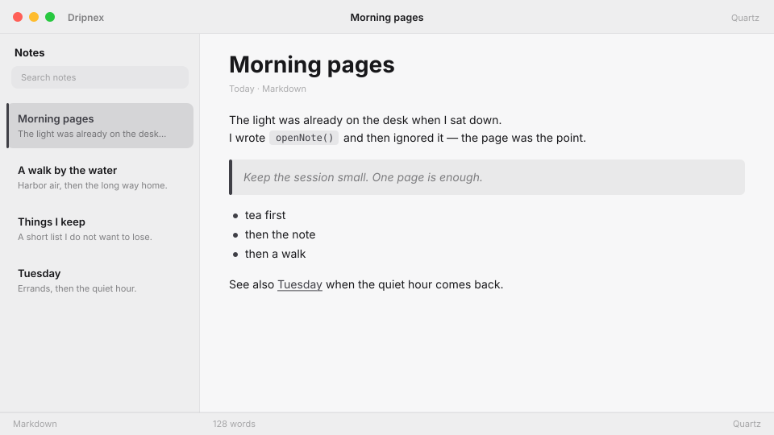

# Quartz

Cold, clean paper. Swiss-quiet white for product notes.



```
dripnex/theme-quartz
```

## Palette

The chips live in [palette.html](palette.html) — open it in a browser. GitHub won’t paint HTML swatches here, so the hex list is below.

| Name | Token | Color | What it’s for |
| --- | --- | --- | --- |
| Base | `--bg-base` | `#f7f7f8` | Window background |
| Surface | `--bg-surface` | `#eeeeef` | Sidebar and chrome |
| Elevated | `--bg-elevated` | `#fcfcfd` | Raised panels |
| Text | `--text-primary` | `#18181b` | Headings and body |
| Muted | `--text-muted` | `#18181b · rgba(24, 24, 27, 0.52)` | Secondary copy |
| Accent | `--accent` | `#3f3f46` | Selection and links |
| Active | `--status-active` | `#3f3f46` | Active status |
| Dropped | `--status-dropped` | `#b42318` | Dropped status |

Pick it when you want cool paper and charcoal ink, not cream.
